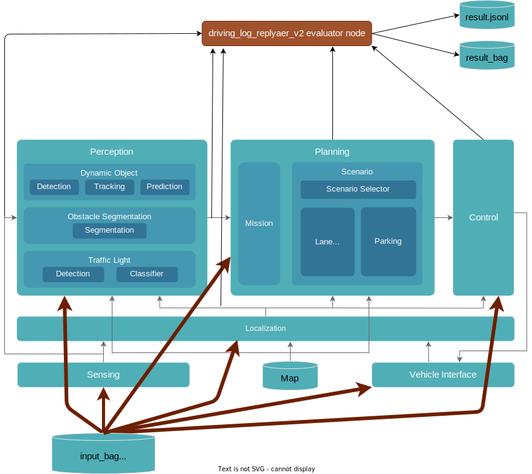
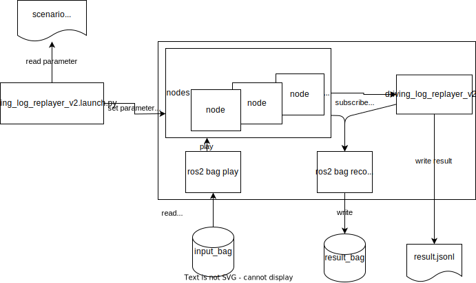

# 概要

driving_log_replayer_v2 は、log(rosbag2)を用いて Autoware の open loop simulation を実行し、Autoware が出力するトピックを評価するパッケージです。
Sensing, Localization, Perception の性能確認と、ソフトウェアのリグレッションテストに使用します。

## 関連ドキュメント

1. [AutowareDocumentation](https://autowarefoundation.github.io/autoware-documentation/main/)
2. [WebAutoDocumentation](https://docs.web.auto/)

## 関連リポジトリ

1. [ros2bag_extensions](https://github.com/tier4/ros2bag_extensions)
2. [perception_eval](https://github.com/tier4/autoware_perception_evaluation)
3. [perception_dataset](https://github.com/tier4/tier4_perception_dataset)

## アーキテクチャ

driving_log_replayer_v2 は、Autoware の評価ノードを Autoware の標準機能に付加した構成となっている。
アーキテクチャ図を以下に示す。

## パッケージ構成

driving_log_replayer_v2 の評価ノードは、以下のように動作します。

- 評価の条件が記載されたシナリオをパッケージが読み取る
- autoware を起動する
- 評価結果を jsonl ファイル形式で出力する

ノードの動作の詳細を下図に示す。

## 利用フロー

1. 評価用の rosbag を実車で取得する
2. 取得した rosbag を必要な時間、topic だけ残るようにフィルタする
   - フィルタ処理には TIER IV で開発した [ros2bag_extensions](https://github.com/tier4/ros2bag_extensions) を使用する
   - フィルタでどのtopicを残すかは、docs/use_case/のドキュメント参照
3. シナリオを作成する
   1. [sample folder](https://github.com/tier4/driving_log_replayer_v2/tree/main/sample) 内にシナリオの例あり
   2. 記述内容は[フォーマット定義](../result_format/index.md)を参照
4. datasetを作成する
   1. localization, eagleye, yabloc, ar_tag_based_localizer, performance_diagに関しては、[Evaluator](https://docs.web.auto/user-manuals/evaluator/introduction)を利用しないなら任意
   2. [perception_dataset tools_overview](https://github.com/tier4/tier4_perception_dataset/blob/main/docs/tools_overview.md)を参考にT4 non-annotated format dataまで作る。
   3. T4 non-annotated format dataまで作成すると、[Vehicle Data Search](https://docs.web.auto/user-manuals/vehicle-data-search/quick-start#t4-dataset-%E3%81%AE%E5%8B%95%E7%94%BB%E8%A1%A8%E7%A4%BA)上でデータセットの内容の確認が可能になる。
5. ユースケースが obstacle_segmentation, perception, perception_2d, traffic_light の場合、t4_dataset への変換に対応したアノテーションツールでアノテーションを実施する。
   1. [Deepen.AI](https://www.deepen.ai/)が利用可能
   2. [perception_dataset](https://github.com/tier4/tier4_perception_dataset)に変換機能を追加すれば他のアノテーションツールも使用可能になる
6. 評価を実行する。
